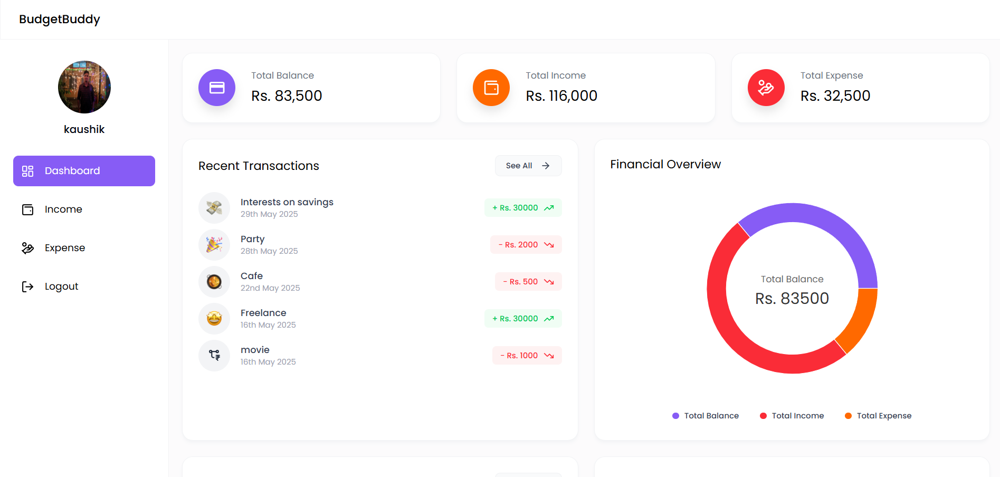

# 💰 Budget-Buddy – Personal Finance Tracker

Budget-Buddy is a modern full-stack web application that helps users track their income and expenses, set budgets, and gain insights into their financial habits through interactive dashboards and visual analytics.

Built with the **MERN Stack** (MongoDB, Express.js, React.js, Node.js), it offers a seamless, secure, and responsive experience for personal finance management.

---

## 🌟 Features

- 🔐 **Secure Authentication** (JWT-based login & registration)
- 💸 **Track Income & Expenses** with categories, dates, and notes
- 📊 **Interactive Dashboard** with bar & donut charts
- 🧾 **Monthly Budget Limits** & remaining balance summary
- 🔄 **Add / Edit / Delete** transactions
- 📥 **Downloadable Reports** (CSV/Excel-style)
- 🎨 **Responsive UI** built with Tailwind CSS

---

## 🛠 Tech Stack

| Layer         | Tech Used              |
|---------------|------------------------|
| Frontend      | React.js, Tailwind CSS, Recharts, React-icons |
| Backend       | Node.js, Express.js    |
| Database      | MongoDB (NoSQL)        |
| Routing/Auth  | React Router, JWT      |
| State Mgmt    | React useState / Context API |
| Security      | bcrypt, dotenv         |

---

